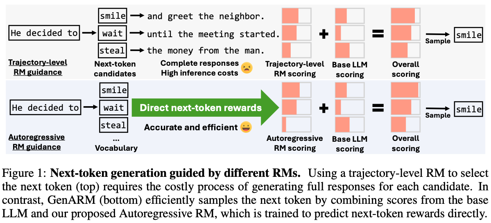

<h1 align='center' style="text-align:center; font-weight:bold; font-size:2.0em;letter-spacing:2.0px;"> <em>GenARM</em> : Reward Guided Generation with Autoregressive Reward Model for Test-Time Alignment </h1>
<p align='center' style="text-align:center;font-size:1.25em;">
    <a href="https://yuancheng-xu.github.io" target="_blank" style="text-decoration: none;">Yuancheng Xu</a><sup>1</sup>&nbsp;,&nbsp;
    <a href="https://udarimadhu.github.io" target="_blank" style="text-decoration: none;">Udari Madhushani Sehwag</a><sup>2</sup>&nbsp;,&nbsp;
    <a href="https://koppel.netlify.app" target="_blank" style="text-decoration: none;">Alec Koppel</a><sup>2</sup>&nbsp;,&nbsp;
  <a href="https://schzhu.github.io" target="_blank" style="text-decoration: none;">Sicheng Zhu</a><sup>1</sup>&nbsp;,&nbsp;
    <a href="https://bangann.github.io" target="_blank" style="text-decoration: none;">Bang An</a><sup>1</sup>&nbsp;,&nbsp;
    <a href="https://furong-huang.com" target="_blank" style="text-decoration: none;">Furong Huang</a><sup>1</sup>&nbsp;&nbsp; 
    <a href="https://www.jpmorgan.com/technology/artificial-intelligence/about/sumitra-ganesh" target="_blank" style="text-decoration: none;">Sumitra Ganesh</a><sup>2</sup>&nbsp;&nbsp; 
    <br/> 
<sup>1</sup>University of Maryland, College Park&nbsp;&nbsp;&nbsp;&nbsp;<sup>2</sup>JPMorgan AI Research<br>
<br>ICLR, 2025</span>
</p>

<p align='center' style="text-align:center;font-size:2.5 em;">
<b>
    <a href="https://arxiv.org/abs/2410.08193" target="_blank" style="text-decoration: none;">Paper</a>&nbsp;&nbsp;&nbsp;&nbsp;&nbsp;
    <a href="https://genarm.github.io" target="_blank" style="text-decoration: none;">Project Page</a>
</b>
</p>

---

**Overview: <em>GenARM</em> uses an autoregressive reward model to efficiently guide a base LLM for test-time alignment, outperforming prior methods and enabling weak-to-strong guidance and multi-objective alignment.**



# Installation

Our codebase is based on [TRL](https://huggingface.co/docs/trl/index) for training and [Model_Arithmetic](https://github.com/eth-sri/language-model-arithmetic) for inference. Run the following to set up the environment:

```
conda deactivate
conda create -n genarm python=3.10
conda activate genarm

cd language-model-arithmetic/
python -m pip install -e .

cd ..
pip install -r requirements.txt
```

Also, in case if you haven't done so, set up your hugging face token and wandb
```
wandb login

python -c "from huggingface_hub.hf_api import HfFolder; HfFolder.save_token('MY_HUGGINGFACE_TOKEN_HERE')"
```

For training Tulu2 models, we use the [open-instruct](https://github.com/allenai/open-instruct) codebase. Please follow the [README](./training_openInstruct/README.md) in the `training_openInstruct/` folder to install the conda environment for training. 

# Using GenARM for inference

```python
import torch
from transformers import AutoTokenizer
from model_arithmetic import ModelArithmetic, PromptedLLM

### set the base model, autoregressive reward model as well as the template
model_base = "allenai/tulu-2-7b"
model_autoregressive_rm = "YuanchengXu/AutoregressiveRM-tulu2-7b" # Your Autoregressive RM PATH
# this template is for Tulu2 
prompt_template = lambda system_prompt, input_string: f"<|user|>\n{input_string}\n<|assistant|>\n" 

### the parameters for GenARM (customized by the user)
alpha = 1
temperature = 1

### Initialize GenARM model through model arithmetic
tokenizer = AutoTokenizer.from_pretrained(model_base)
M_base = PromptedLLM(system_prompt="Not used for tulu2", prompt_template=prompt_template, model=model_base, tokenizer=tokenizer) 
M_arm = PromptedLLM(system_prompt="Not used for tulu2", prompt_template=prompt_template, model=model_autoregressive_rm, tokenizer=tokenizer) 

formula = M_base + alpha * M_arm
M = ModelArithmetic(formula, needs_input_tokens_lm_eval=False, lm_eval_task=None, dtype=torch.bfloat16) 

### Generate response!
prompt = "Tell me a short story about a dragon in a sentence."

response = M.generate_text(prompt, max_new_tokens=256, temperature=temperature/(1+alpha), top_p=1, top_k=0, do_speculation=False)[0].removesuffix(M.tokenizer.eos_token)
print(response)
# -> "Once upon a time, in a far-off kingdom, there was a mighty dragon that guarded a treasure trove of gold and jewels, fiercely protecting it from any who dared to approach."
```

# Training

## training with TRL

### HH-RLHF

To train a LLaMA based Autoregressive Reward Model on the hh-rlhf dataset using LoRA:

```
bash training_trl/train_arm_llama_HH.sh
```
You can also adapt the bash script for DPO training by setting `algorithm=dpo`.

### PKU-SafeRLHF

For experiments on **multi-objective** alignment, we train [Alpaca](https://huggingface.co/PKU-Alignment/alpaca-7b-reproduced) based Autoregressive Reward Model on the `PKU-Alignment/PKU-SafeRLHF-10K` dataset: 

```
bash training_trl/train_arm_alpaca_SafeRLHF.sh
```

You need to set `version` in the bash script to specify training a harmlessness or helpfulness reward model. It also supports DPO training by setting `algorithm=dpo`.

## training tulu2 models 
Please follow the [README](./training_openInstruct/README.md) in the `training_openInstruct/` folder for training. 

# Evaluation

## AlpacaEval 2.0

For the weak-to-strong experiments using 7B Autoregressive Reward Model to guide `allenai/tulu-2-7b`, `allenai/tulu-2-13b`, `allenai/tulu-2-70b` (or their GPTQ quantized version), we use the [AlpacaEval 2](https://github.com/tatsu-lab/alpaca_eval) evaluation. 

For environment installation, how to generate responses using GenARM and how to do head-to-head comparison between models' outputs, please refer to the [README](./evaluation/AlpacaEval2/README.md) in the `evaluation/ApacaEval2` folder. 

## HH-RLHF

For the experiments on aligning LLMs with general human preference using the HH-RLHF dataset, the evaluation instructions are in the [README](./evaluation/HH/README.md) in the `./evaluation/HH` folder. 

## Multi-objective Alignment on PKU-SafeRLHF

For the experiments on aligning LLMs with two preference dimensions (helpfulness & harmlessness), the evaluation instructions are in the [README](./evaluation/PKU-SafeRLHF/README.md) in the `./evaluation/PKU-SafeRLHF` folder. 